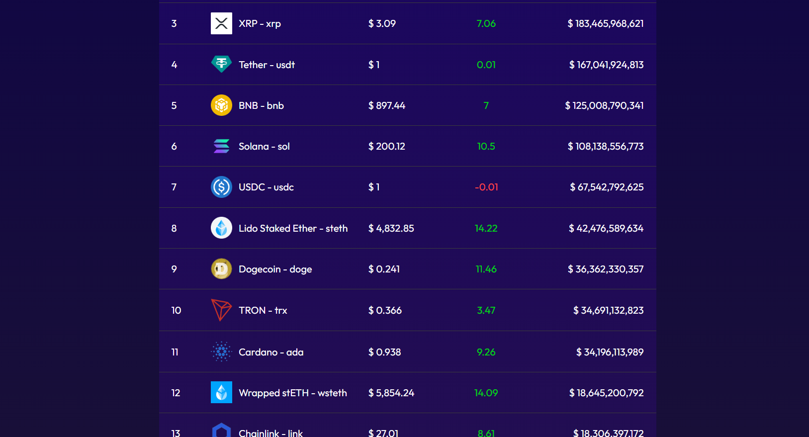
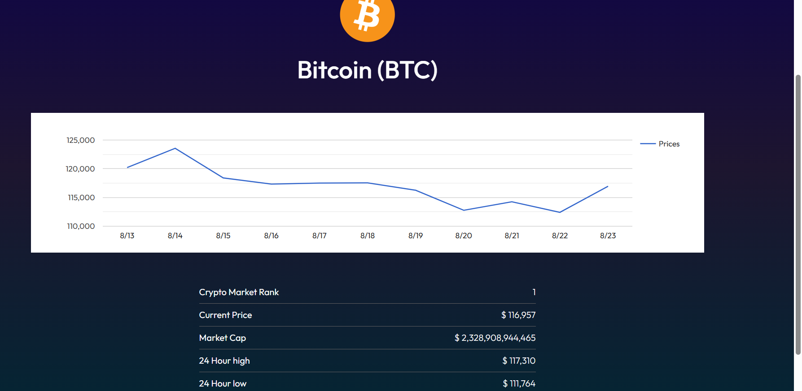

# 🚀 Crypto Tracking App

A simple and powerful **Crypto Tracking Application** that allows users to view real-time cryptocurrency prices, market trends, and portfolio insights.  

---

## 📌 Features
- 🔄 **Live Price Updates** for popular cryptocurrencies (BTC, ETH, etc.)
- 📊 **Interactive Charts** to track price history
- 💰 **Portfolio Tracking** (Add, Edit, Remove coins)
- 🌙 **Light/Dark Mode**
- 🔍 **Search & Filter** cryptocurrencies
- ⚡ **Responsive UI** for desktop and mobile

---

## 🛠️ Tech Stack
- **Frontend:** React.js / Next.js, Tailwind CSS / Bootstrap  
- **API:** CoinGecko / Binance / CryptoCompare (for live crypto data)  

---

##  📸 Screenshots
 🎬Demo
### 🏠 Home Page
   
   
---
### 🎬  Demo
  

---
### 🎬 Demo
  
  

---
### 🤝 Contributing
   Contributions are welcome! Please fork this repo and submit a pull request.
  

